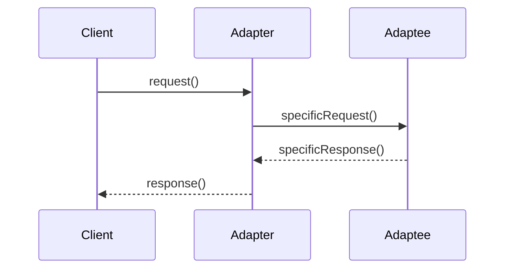
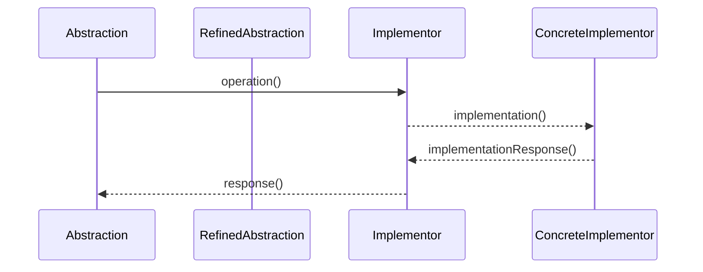
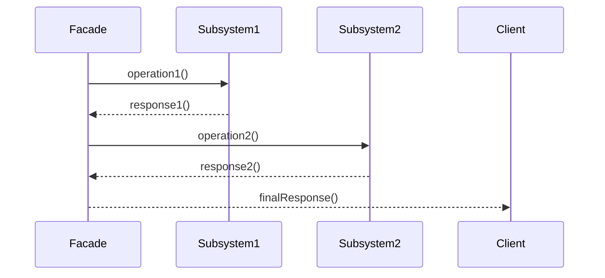

# Aufgabe 1: Ablaufbeschreibung von Pattern

Beschreiben sie den Ablauf von Adapter-, Bridge- und Facade-Pattern mit Sequenzdiagrammen. Nutzen sie möglichst viele Elemente eines UML-Sequenzdiagramms.

## Adapter Pattern

Das Adapter Pattern ermöglicht es, zwei inkompatible Schnittstellen miteinander zu verbinden. Der Client kommuniziert mit dem Adapter, der die Anfrage an den Adaptee weiterleitet. Der Adaptee führt die spezifische Anfrage aus und sendet die Antwort zurück an den Adapter, der sie dann an den Client weitergibt.





## Bridge Pattern

Das Bridge Pattern trennt die Abstraktion von der Implementierung, sodass beide unabhängig voneinander variiert werden können. Die Abstraktion kommuniziert mit dem Implementor, der die spezifische Implementierung durchführt. Die Antwort wird dann an die Abstraktion zurückgegeben.


### Code Example
```java
// Bridge Pattern Example with Explanations in Java
// Implementor Interface
interface Implementor {
    void operationImpl();
}
// Concrete Implementor
class ConcreteImplementorA implements Implementor {
    public void operationImpl() {
        System.out.println("ConcreteImplementorA: operationImpl");
    }
}
class ConcreteImplementorB implements Implementor {
    public void operationImpl() {
        System.out.println("ConcreteImplementorB: operationImpl");
    }
}
// Abstraction Class
abstract class Abstraction {
    protected Implementor implementor;
    public Abstraction(Implementor implementor) {
        this.implementor = implementor;
    }
    public abstract void operation();
}
// Refined Abstraction
class RefinedAbstraction extends Abstraction {
    public RefinedAbstraction(Implementor implementor) {
        super(implementor);
    }
    public void operation() {
        System.out.println("RefinedAbstraction: operation");
        implementor.operationImpl();
    }
}
// Client Code
public class BridgePatternExample {
    public static void main(String[] args) {
        Implementor implementorA = new ConcreteImplementorA();
        Abstraction abstractionA = new RefinedAbstraction(implementorA);
        abstractionA.operation();

        Implementor implementorB = new ConcreteImplementorB();
        Abstraction abstractionB = new RefinedAbstraction(implementorB);
        abstractionB.operation();
    }
}
```

### Facade Pattern
Das Facade Pattern bietet eine vereinfachte Schnittstelle zu einem komplexen System. Der Facade-Objekt kommuniziert mit verschiedenen Subsystemen und aggregiert deren Antworten, um dem Client eine einfache Schnittstelle zu bieten. Der Client interagiert nur mit der Facade, ohne sich um die Details der Subsysteme kümmern zu müssen.


## Erklärung der Diagramme

Die drei Design-Patterns Adapter, Bridge und Facade bieten unterschiedliche Ansätze zur Strukturierung von Code und zur Verbesserung der Wartbarkeit. Während das Adapter Pattern dazu dient, inkompatible Schnittstellen zu verbinden, ermöglicht das Bridge Pattern eine flexible Trennung von Abstraktion und Implementierung. Das Facade Pattern hingegen vereinfacht den Zugriff auf komplexe Systeme durch eine einheitliche Schnittstelle.